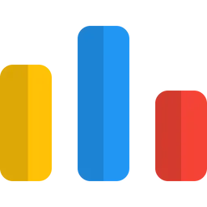

---

  
 3𝒓𝒅-𝒚𝒆𝒂𝒓 𝒔𝒕𝒖𝒅𝒆𝒏𝒕 @ 𝐏.𝐓.𝐔.𝐊

  
 𝑭𝒓𝒐𝒎 𝑲𝒊𝒇𝒆𝒍 𝑯𝒂𝒓𝒆𝒔  ✌︎︎ ︎فِلَـسَـٓــِٰٓطٓـيَنُ

  
 👨‍💻Ｃｏｄｅｒ || 🎮Ｇａｍｅｒ

---

  <h2 style="font-family: 'Poppins', sans-serif; color:#3498DB;">𝓣𝓮𝓬𝓱 𝓘’𝓶 𝓛𝓮𝓪𝓻𝓷𝓲𝓷𝓰 & 𝓤𝓼𝓲𝓷𝓰</h2>

  
  
  
  
  
  
  
  
  
  
  
  
  
  
  
  
  
    
  
  
  

---

  <h2 style="font-family: 'Poppins', sans-serif; color:#3498DB;">𝓙𝓾𝓼𝓽 𝓪 𝓕𝓮𝔀 𝓕𝓾𝓷 𝓕𝓪𝓬𝓽𝓼</h2>

 🌐 𝚂𝚝𝚊𝚛𝚝𝚒𝚗𝚐 𝚖𝚢 𝚆𝚎𝚋 𝙳𝚎𝚟𝚎𝚕𝚘𝚙𝚖𝚎𝚗𝚝 𝚓𝚘𝚞𝚛𝚗𝚎𝚢 🌐
   
 🛠️ 𝙰𝚕𝚠𝚊𝚢𝚜 𝚕𝚘𝚘𝚔𝚒𝚗𝚐 𝚝𝚘 𝚋𝚞𝚒𝚕𝚍 𝚜𝚖𝚊𝚕𝚕, 𝚏𝚞𝚗 𝚙𝚛𝚘𝚓𝚎𝚌𝚝𝚜 🛠️
   
 🧠 𝙰𝙳𝙷𝙳 𝚋𝚛𝚊𝚒𝚗 = 𝙷𝚢𝚙𝚎𝚛𝚏𝚘𝚌𝚞𝚜 𝚞𝚗𝚕𝚘𝚌𝚔𝚎𝚍 🧠
   
 	🧩 𝙶𝚘𝚝 𝚊 𝚙𝚒𝚎𝚌𝚎? 𝙻𝚎𝚝’𝚜 𝚌𝚘𝚖𝚙𝚕𝚎𝚝𝚎 𝚒𝚝 𝚝𝚘𝚐𝚎𝚝𝚑𝚎𝚛 🧩

---

  
<h2 style="font-family: 'Poppins', sans-serif; color:#3498DB;">𝓐𝓫𝓸𝓾𝓽 𝓜𝓮 (𝒄𝒍𝒊𝒄𝒌 𝒕𝒐 𝒆𝒙𝒑𝒂𝒏𝒅)</h2>

   
  Passionate and driven **Computer Systems Engineering student** at **Palestine Technical University – Kadoorie (P.T.U.K)**, currently in my third year. My academic journey has equipped me with a strong foundation in **Programming**, **Object-Oriented Programming (OOP)**, **Data Structures**, and **Databases**, along with hands-on experience in **C++**, **Java**, **SQL**, and **Oracle**. I also have a solid understanding of **Mathematics**, **Digital Logic**, and **Electronics**, which I apply to tackle real-world engineering challenges.
   
  Beyond academics, I have a strong passion for **problem-solving**, **gaming**, and **technology**. I enjoy exploring new programming challenges, turning complex problems into efficient solutions, and immersing myself in the strategic worlds of **video games**. These experiences have honed my **critical thinking**, **teamwork**, and **perseverance**—skills I actively bring to my professional life and apply to practical projects.
   
  I’m eager to connect with like-minded professionals, collaborate on **innovative projects**, and contribute to the ever-evolving world of **programming and software development**. Let’s connect and explore opportunities to learn, grow, and make an impact together!

---

  <h2 style="font-family: 'Poppins', sans-serif; color:#3498DB;">𝓒𝓸𝓷𝓽𝓪𝓬𝓽 𝓜𝓮</h2>

  
  
  
  
  
  
  
  
  
  
  
  
  
  
  
  
  

  
  
   

---

