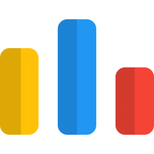

---

  
 3𝒓𝒅-𝒚𝒆𝒂𝒓 𝒔𝒕𝒖𝒅𝒆𝒏𝒕 @ 𝐏.𝐓.𝐔.𝐊

  
 𝑭𝒓𝒐𝒎 𝑲𝒊𝒇𝒆𝒍 𝑯𝒂𝒓𝒆𝒔  ✌︎︎ ︎فِلَـسَـٓــِٰٓطٓـيَنُ

  
 👨‍💻Ｃｏｄｅｒ || 🎮Ｇａｍｅｒ

---

  <h2 style="font-family: 'Poppins', sans-serif; color:#3498DB;">𝓣𝓮𝓬𝓱 𝓘’𝓶 𝓛𝓮𝓪𝓻𝓷𝓲𝓷𝓰 & 𝓤𝓼𝓲𝓷𝓰</h2>

  <h3 style="font-family: 'Poppins', sans-serif; color:#3498DB;">𝓛𝓪𝓷𝓰𝓾𝓪𝓰𝓮𝓼</h3>

  
  
  
  
  
  
  
  
  
  
  
  
  
  
  

  <h3 style="font-family: 'Poppins', sans-serif; color:#3498DB;">𝓓𝓪𝓽𝓪𝓫𝓪𝓼𝓮𝓼</h3>

  
  
  
  
  

  <h3 style="font-family: 'Poppins', sans-serif; color:#3498DB;">	𝓣𝓸𝓸𝓵𝓼 & 𝓘𝓓𝓔𝓼</h3>

  
  
  
  
  
  
  
  
  
  
  
  
  
  
  
  
  

---

  <h2 style="font-family: 'Poppins', sans-serif; color:#3498DB;">𝓙𝓾𝓼𝓽 𝓪 𝓕𝓮𝔀 𝓕𝓾𝓷 𝓕𝓪𝓬𝓽𝓼</h2>

 🌐 𝚂𝚝𝚊𝚛𝚝𝚒𝚗𝚐 𝚖𝚢 𝚆𝚎𝚋 𝙳𝚎𝚟𝚎𝚕𝚘𝚙𝚖𝚎𝚗𝚝 𝚓𝚘𝚞𝚛𝚗𝚎𝚢 🌐
   
 🛠️ 𝙰𝚕𝚠𝚊𝚢𝚜 𝚕𝚘𝚘𝚔𝚒𝚗𝚐 𝚝𝚘 𝚋𝚞𝚒𝚕𝚍 𝚜𝚖𝚊𝚕𝚕, 𝚏𝚞𝚗 𝚙𝚛𝚘𝚓𝚎𝚌𝚝𝚜 🛠️
   
 🧠 𝙰𝙳𝙷𝙳 𝚋𝚛𝚊𝚒𝚗 = 𝙷𝚢𝚙𝚎𝚛𝚏𝚘𝚌𝚞𝚜 𝚞𝚗𝚕𝚘𝚌𝚔𝚎𝚍 🧠
   
 	🧩 𝙶𝚘𝚝 𝚊 𝚙𝚒𝚎𝚌𝚎? 𝙻𝚎𝚝’𝚜 𝚌𝚘𝚖𝚙𝚕𝚎𝚝𝚎 𝚒𝚝 𝚝𝚘𝚐𝚎𝚝𝚑𝚎𝚛 🧩

---

  
<h2 style="font-family: 'Poppins', sans-serif; color:#3498DB;">𝓐𝓫𝓸𝓾𝓽 𝓜𝓮 (𝒄𝒍𝒊𝒄𝒌 𝒕𝒐 𝒆𝒙𝒑𝒂𝒏𝒅)</h2>

   
  Fourth-year 𝑪𝒐𝒎𝒑𝒖𝒕𝒆𝒓 𝑺𝒚𝒔𝒕𝒆𝒎𝒔 𝑬𝒏𝒈𝒊𝒏𝒆𝒆𝒓𝒊𝒏𝒈 student at 𝐏𝐚𝐥𝐞𝐬𝐭𝐢𝐧𝐞 𝐓𝐞𝐜𝐡𝐧𝐢𝐜𝐚𝐥 𝐔𝐧𝐢𝐯𝐞𝐫𝐬𝐢𝐭𝐲 – 𝐊𝐚𝐝𝐨𝐨𝐫𝐢𝐞 (P.T.U.K). Strong foundation in 𝗣𝗿𝗼𝗴𝗿𝗮𝗺𝗺𝗶𝗻𝗴, 𝗢𝗢𝗣, 𝗗𝗮𝘁𝗮 𝗦𝘁𝗿𝘂𝗰𝘁𝘂𝗿𝗲𝘀, 𝗦𝗼𝗳𝘁𝘄𝗮𝗿𝗲 𝗘𝗻𝗴𝗶𝗻𝗲𝗲𝗿𝗶𝗻𝗴, and 𝗗𝗮𝘁𝗮𝗯𝗮𝘀𝗲𝘀—with hands-on experience in 𝙿𝚢𝚝𝚑𝚘𝚗, 𝙹𝚊𝚟𝚊, 𝙲++, 𝙲#, 𝙹𝚊𝚟𝚊𝚂𝚌𝚛𝚒𝚙𝚝, 𝚃𝚢𝚙𝚎𝚂𝚌𝚛𝚒𝚙𝚝, 𝙾𝚛𝚊𝚌𝚕𝚎, 𝙿𝚘𝚜𝚝𝚐𝚛𝚎𝚂𝚀𝙻, 𝙳𝚛𝚒𝚣𝚣𝚕𝚎 𝙾𝚁𝙼, 𝙳𝚘𝚌𝚔𝚎𝚛, 𝙷𝚃𝙼𝙻, and 𝙲𝚂𝚂. I'm building my 𝗪𝗲𝗯 𝗗𝗲𝘃𝗲𝗹𝗼𝗽𝗺𝗲𝗻𝘁 skills and learning through the 𝗙𝗼𝗼𝘁𝗛𝗶𝗹𝗹 𝗫 𝗕𝗼𝗼𝘁.𝗱𝗲𝘃 program (TypeScript, HTTP, and more).
   
   
  Passionate about 𝙥𝙧𝙤𝙗𝙡𝙚𝙢-𝙨𝙤𝙡𝙫𝙞𝙣𝙜 and 𝘵𝘦𝘤𝘩—I enjoy turning complex problems into efficient solutions. I bring 𝗰𝗿𝗶𝘁𝗶𝗰𝗮𝗹 𝘁𝗵𝗶𝗻𝗸𝗶𝗻𝗴, 𝘁𝗲𝗮𝗺𝘄𝗼𝗿𝗸, and 𝗽𝗲𝗿𝘀𝗲𝘃𝗲𝗿𝗮𝗻𝗰𝗲 to 𝗽𝗿𝗮𝗰𝘁𝗶𝗰𝗮𝗹 𝗽𝗿𝗼𝗷𝗲𝗰𝘁𝘀.
   
   
  Eager to connect, collaborate on 𝗶𝗻𝗻𝗼𝘃𝗮𝘁𝗶𝘃𝗲 𝗽𝗿𝗼𝗷𝗲𝗰𝘁𝘀, and keep growing in 𝗽𝗿𝗼𝗴𝗿𝗮𝗺𝗺𝗶𝗻𝗴 and 𝘀𝗼𝗳𝘁𝘄𝗮𝗿𝗲 𝗱𝗲𝘃𝗲𝗹𝗼𝗽𝗺𝗲𝗻𝘁. Let's connect!

---

  <h2 style="font-family: 'Poppins', sans-serif; color:#3498DB;">𝓒𝓸𝓷𝓽𝓪𝓬𝓽 𝓜𝓮</h2>

  
  
  
  
  
  
  
  
  
  
  
  
  
  
  
  
  

  
  
   

---

<picture>
  <source media="(prefers-color-scheme: dark)" srcset="https://raw.githubusercontent.com/Amer-Abuyaqob/Amer-Abuyaqob/output/pacman-contribution-graph-dark.svg">
  <source media="(prefers-color-scheme: light)" srcset="https://raw.githubusercontent.com/Amer-Abuyaqob/Amer-Abuyaqob/output/pacman-contribution-graph.svg">
  
</picture>

###

